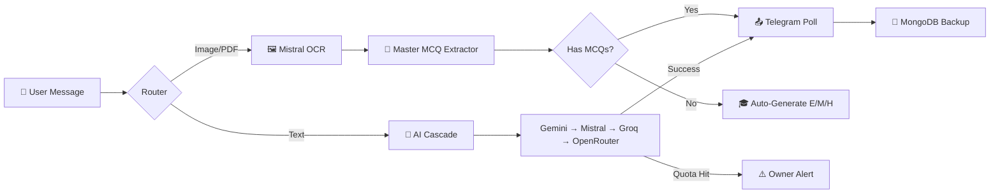

<div align="center">


<a href="https://git.io/typing-svg">
  
</a>

<br/>


</div>

---

<div align="center">
  
</div>

## 🌊 প্রবাহ — সংক্ষেপে

একটি **প্রফেশনাল, ৫১-সেকশনের মডুলার Telegram বট** — Render Free Web Service এ ডিপ্লয়যোগ্য। ছবি/PDF থেকে অটো MCQ এক্সট্রাকশন, আনলিমিটেড কুইজ জেনারেশন, multi-provider AI cascading failover, এবং MongoDB persistent backup সহ একটি **Master-Class Quiz Bot**।

> 💡 **এক লাইনে:** *"যেখানে অন্য বট থেমে যায়, প্রবাহ সেখান থেকে শুরু করে।"*

---

## ✨ মূল ফিচার

<table>
<tr>
<td width="50%" valign="top">

### 🤖 AI & Intelligence
- 🧠 **Multi-AI Routing** — Gemini, Mistral, Perplexity, Groq, OpenRouter, DeepSeek
- ⚡ **Cascading Failover** — একটা প্রোভাইডার ডাউন হলে অটো পরেরটায় switch
- 🔑 **Multi-Key Pool** — প্রতি প্রোভাইডারে আনলিমিটেড API key + auto rotation
- 📊 **Quota Alerts** — কোটা শেষ হওয়ার আগেই owner কে notification
- ♾️ **Unlimited Quiz Generation** — যত key/provider, তত unlimited

</td>
<td width="50%" valign="top">

### 📚 OCR & Quiz Engine
- 🖼️ **Mistral OCR** — ছবি + PDF (page-by-page processing)
- 🎯 **Master MCQ Extractor** — ক)খ)গ)ঘ), a)b)c)d), ⓐⓑⓒⓓ সব format সাপোর্ট
- 🎓 **Auto Question Generation** — Easy / Medium / Hard count preview সহ
- 📝 **Telegram-Friendly Format** — LaTeX strip, 200-char explanation limit
- 📄 **CSV Export** — Math এর জন্য LaTeX format preserved

</td>
</tr>
<tr>
<td width="50%" valign="top">

### 🎙️ Voice & Media
- 🎤 **ElevenLabs Voice-to-Text** — high-accuracy speech recognition
- 🖼️ **Image Analysis** — Gemini Vision integration
- 📑 **PDF Page-by-Page** — error-isolated processing
- 🔊 **Audio reply support** — voice messages handled natively

</td>
<td width="50%" valign="top">

### 👥 Groups & Access Control
- 🌐 **Group + Topic Support** — cross-chat reply routing
- 🔐 **Role-based Permissions** — Owner / Admin / User isolation
- 📋 **A→Z Owner Command Menu** — full command list in `/` menu
- 💾 **MongoDB Backup** — weekly auto-backup (Sunday 03:00 UTC)
- ❤️ **Render Health Page** — live status + uptime monitoring

</td>
</tr>
</table>

---

## 🚀 কুইক স্টার্ট

<details>
<summary><b>💻 লোকাল রান (Click to expand)</b></summary>

```bash
# 1️⃣ Clone the repo
git clone <your-repo-url>
cd probaho-bot

# 2️⃣ Install dependencies
pip install -r requirements.txt

# 3️⃣ Set environment variables
export BOT_TOKEN="123456:ABC..."
export OWNER_ID="123456789"
export MONGO_URI="mongodb+srv://..."
export GEMINI_API_KEY="AIzaSy..."
export MISTRAL_API_KEY="..."
export ELEVENLABS_API_KEY="..."

# 4️⃣ Run
python main.py
```

</details>

<details open>
<summary><b>☁️ Render Deploy (১ ক্লিকে) — Recommended</b></summary>

| Step | Action |
|:---:|---|
| **1** | Render Dashboard → **New +** → **Blueprint** |
| **2** | এই repo সিলেক্ট → **Apply** ক্লিক (`render.yaml` auto-detect) |
| **3** | Environment tab এ সবগুলো secret সেট করুন (নিচের টেবিল দেখুন) |
| **4** | Deploy শেষ হলে URL পাবেন: `https://<your-app>.onrender.com` |
| **5** | UptimeRobot এ `/healthz` ping সেট করুন (প্রতি 5 মিনিট) |

</details>

---

## 🔐 Environment Variables

| Variable | Required | বর্ণনা |
|---|:---:|---|
| `BOT_TOKEN` | ✅ | Telegram BotFather token |
| `OWNER_ID` | ✅ | Owner Telegram ID (comma-separated for multi-owner) |
| `MONGO_URI` | ✅ | MongoDB Atlas connection string (persistent backup) |
| `GEMINI_API_KEY` | ⚪ | Google AI Studio key (in-bot `/addkey` ও কাজ করে) |
| `MISTRAL_API_KEY` | ⚪ | Mistral OCR key (in-bot multi-key supported) |
| `ELEVENLABS_API_KEY` | ⚪ | Voice-to-text key |

> 💡 **Tip:** ⚪ optional keys গুলো in-bot `/addkey` কমান্ড দিয়েও add করা যায় — DB তে save হয়ে rotation চলবে।

---

## 🏥 Health Endpoints

<div align="center">

| Endpoint | Purpose | Response |
|:---:|:---:|:---:|
| 🟢 `/` | Rich HTML status page | `text/html` |
| 💓 `/healthz` | UptimeRobot ping (2 byte) | `OK` |
| 📊 `/status.json` | Programmatic JSON status | `application/json` |

</div>

> ⚠️ **Render Free Notice:** 15 মিনিট idle হলে service sleep হয়। **UptimeRobot** বা **cron-job.org** দিয়ে `/healthz` প্রতি 5 মিনিটে ping করুন।

---

## 🎯 Owner Commands (A → Z)

<details>
<summary><b>📋 Full Command List (Click to expand)</b></summary>

| Command | কাজ |
|---|---|
| `/addkey <provider> <key>` | নতুন AI API key add |
| `/keys` | সব saved key দেখা |
| `/delkey <id>` | নির্দিষ্ট key remove |
| `/advmode` | Advanced provider dashboard (interactive) |
| `/advadd <name> <kind> [model] [key]` | নতুন AI provider add |
| `/advrm <id>` | Provider remove |
| `/advprio <id> <n>` | Provider priority adjust |
| `/gemini`, `/mistral`, `/mk` | Model switch |
| `/gen` | Quiz generation start |
| `/ans`, `/pans`, `/qa`, `/qans` | Answer modes |
| `/info`, `/features` | Bot info |
| `/restart`, `/sh` | System control |
| `/tutorial`, `/porag` | Help & guides |

</details>

---

## 🗂️ প্রজেক্ট স্ট্রাকচার

```text
probaho-bot/
├── 📁 bot/
│   ├── __main__.py              # Entrypoint (loads all sections)
│   ├── config.py                # Env-based secrets/config
│   └── 📁 sections/             # ⚡ 51 modular sections
│       ├── 00_header_imports.py
│       ├── 01_config.py
│       ├── ...
│       ├── 48_render_health_page_06_13.py
│       ├── 49_owner_full_command_menu_06_13.py
│       ├── 50_master_ocr_quiz_extractor_06_13.py
│       └── 51_advanced_quiz_mode_06_13.py  ⭐ NEW
├── main.py                      # Render entry shim
├── render.yaml                  # Blueprint config
├── requirements.txt             # Python deps
├── runtime.txt                  # Python 3.11.9
├── Procfile                     # Process declaration
└── README.md                    # You are here 📍
```

---

## 🌟 Architecture Highlights



---

## 📊 Stats

<div align="center">


</div>

---

<div align="center">

## 💖 Credits

**Built with ❤️ by [@Your_Himus](https://t.me/Your_Himus)**


<sub>© 2026 mhx2n — Private project. All rights reserved.</sub>


</div>
